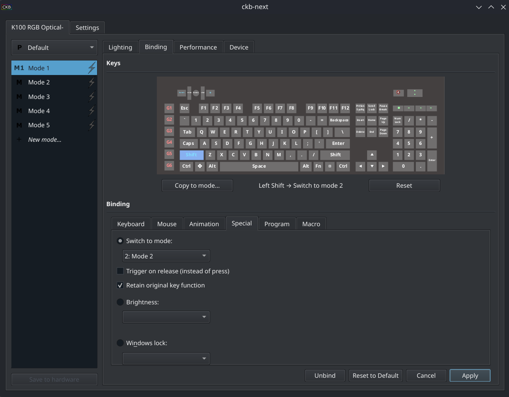
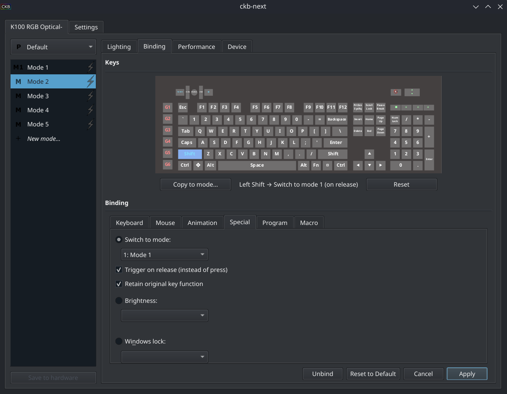

# ckb-next — Mode Shift Enhanced Fork

A fork of [ckb-next](https://github.com/ckb-next/ckb-next) adding **hold-to-shift mode** functionality to the Special binding tab.

> **Base version:** ckb-next v0.6.2  
> **Fork by:** [storymode-exe](https://github.com/storymode-exe)

---

## What's New

### Trigger on Release
Bind a key to switch modes **on key release** instead of key press.

### Retain Original Key Function
Check this to keep the key's original function while also switching modes — the key still types/acts normally, it *also* switches modes.

### Fixed: Unchecking Mode Clears Binding
Previously, unchecking "Switch to mode" and clicking Apply would leave the old binding in place. Now it properly clears.

---

## Hold-to-Shift Mode Behavior

The combination of these two options enables **hold-to-shift** — a key that temporarily shifts to a different mode while held, and reverts when released:

**Mode 1** — bind your key to:
- Switch to Mode 2
- ✅ Retain original key function

**Mode 2** — bind the same key to:
- Switch to Mode 1
- ✅ Trigger on release
- ✅ Retain original key function

Now holding the key shifts to Mode 2. Releasing it shifts back to Mode 1. The key still works normally the whole time. You can set both Modes to look identical, but have some new keys color change in Mode 2, for games that support modifier keys, such as Star Citizen, or other MMOs.

### Star Citizen Example
- **Mode 1** — Default SC lighting
- **Mode 2** — Flight mode (highlights WASD, QE, flight keys)

Bind **Left Alt** in Mode 1: Switch to Mode 2, on press, retain function  
Bind **Left Alt** in Mode 2: Switch to Mode 1, on release, retain function

Hold Alt → flight mode colors. Release → back to normal. Alt still works in-game throughout.

---

## Screenshots

<!-- Add screenshots here after building -->

**Special tab — new options:**





---

## Installation

### Option 1: Pre-built Binary (easiest)

**Requirements:** ckb-next must already be installed on your system (for the daemon).

1. Download `ckb-next-v0.6.2-modeshift_enhanced-x86_64.tar.gz` from the [latest release](https://github.com/storymode-exe/ckb-next/releases/latest)
2. Extract it:
   ```bash
   tar -xzf ckb-next-v0.6.2-modeshift_enhanced-x86_64.tar.gz
   ```
3. Stop the current ckb-next GUI:
   ```bash
   pkill ckb-next
   ```
4. Run the new binary directly:
   ```bash
   ./ckb-next --background
   ```
   Or replace your existing installation:
   ```bash
   sudo cp ckb-next /usr/bin/ckb-next
   ckb-next --background
   ```

> **Note:** This is an x86_64 binary built on Fedora 43. It should work on most modern Linux distros. The ckb-next **daemon** from your distro's package is still required and does not need to be replaced.

>  **Bazzite/Fedora Atomic users:** `/usr/bin` is immutable. Follow these steps instead:
> ```bash
> # 1. Copy binary to local bin
> cp ckb-next ~/.local/bin/ckb-next
> chmod +x ~/.local/bin/ckb-next
>
> # 2. Fix the start menu launcher
> cp /usr/share/applications/ckb-next.desktop ~/.local/share/applications/ckb-next.desktop
> sed -i 's|/usr/bin/ckb-next|/var/home/$USER/.local/bin/ckb-next|g' ~/.local/share/applications/ckb-next.desktop
> update-desktop-database ~/.local/share/applications/
>
> # 3. Fix autostart
> chmod u+w ~/.config/autostart/ckb-next.autostart.desktop
> sed -i 's|/usr/bin/ckb-next|/var/home/$USER/.local/bin/ckb-next|g' ~/.config/autostart/ckb-next.autostart.desktop
> ```

---

## Option 2: Arch / CachyOS / Manjaro (PKGBUILD)

Builds from source using your system's own libraries — no version mismatch issues. No prior ckb-next installation needed.

```bash
git clone https://github.com/storymode-exe/ckb-next
cd ckb-next/packages
makepkg -si
```

This installs everything — daemon, GUI, animations, autostart — in one step.

---

## Option 3: Fedora (standard, non-Atomic only)

> **Bazzite / Fedora Atomic users:** Your OS is immutable — RPMs cannot install to `/usr` normally. Use the **pre-built binary** option above instead.

Download `ckb-next-modeshift-0.6.2-1.fc43.x86_64.rpm` from the [latest release](https://github.com/storymode-exe/ckb-next/releases/latest) and install it:

```bash
sudo dnf install ckb-next-modeshift-0.6.2-1.fc43.x86_64.rpm
```

This installs everything — daemon, GUI, animations, autostart — in one step. No prior ckb-next installation needed.

> If you prefer to build the RPM yourself from source, the SPEC file is available in the `packages/` folder of the repository.

---

## Building from Source

### Requirements
- cmake
- gcc / g++
- Qt6 development packages
- libusb1
- systemd (libudev)
- zlib
- QuaZip (Qt6)
- xcb-util-wm
- wayland-protocols

### Fedora / Bazzite (via distrobox)

```bash
# Create a build container
distrobox create --name ckb-dev --image fedora:43
distrobox enter ckb-dev

# Install dependencies
sudo dnf install -y cmake gcc-c++ qt6-qtbase-devel qt6-qttools-devel \
    libusb1-devel systemd-devel zlib-devel git \
    quazip-qt6-devel xcb-util-wm-devel wayland-protocols-devel

# Clone and build
git clone https://github.com/storymode-exe/ckb-next
cd ckb-next
mkdir build && cd build
cmake .. -DCMAKE_BUILD_TYPE=Release
make -j$(nproc)
```

The GUI binary will be at `build/bin/ckb-next`.

### Installing

The ckb-next **daemon** (`ckb-next-daemon`) handles USB communication and runs as a system service. You only need to replace the **GUI** binary — the daemon from your distro's package is compatible.

```bash
# Stop the current GUI
pkill ckb-next

# Copy the new binary (adjust path as needed)
sudo cp build/bin/ckb-next /usr/bin/ckb-next

# Restart
ckb-next --background
```

> **Bazzite note:** `/usr` is immutable. Copy the binary to `~/.local/bin/` instead and update your autostart entry.

---

## Upstream

This fork tracks [ckb-next/ckb-next](https://github.com/ckb-next/ckb-next) at v0.6.2.  
A PR to upstream is planned once the feature is stable.

---

## License

GPL v2 — same as upstream ckb-next.
